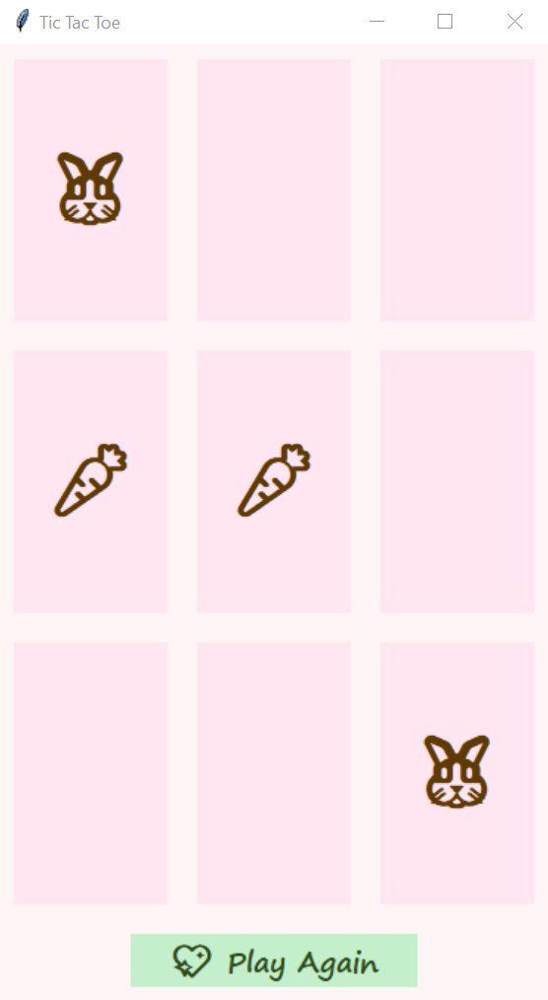

# 🐰🎀 Cute Cartoon-style Tic Tac Toe Game (Python + Tkinter)

Welcome to the cutest Tic Tac Toe game ever! Built with Python, Tkinter, and sprinkled with love, this project features custom emojis, background music, animated confetti, and pop-up messages for an extra delightful game experience. 🎮✨

## ✨ Features

    🥕 X as Carrot and 🐰 O as Bunny

    🎶 Background Music (loops forever!)

    🎊 Animated Confetti on Win

    🧡 Cute Popups with Emojis

    💖 Play Again Button

    💻 Simple GUI built with tkinter

## 📁 File Structure
    ├── game.py         # Game logic (Tic Tac Toe rules)
    ├── ui.py           # User Interface using Tkinter
    ├── main.py         # Entry point
    ├── cute_music.mp3  # Background music (add your own)

## 🧠 How It Works
### 1. game.py – Core Game Logic

    TicTacToeGame: Manages the board, player turns, winner checking, and draw detection.

    make_move(row, col): Updates the board if the move is valid.

    check_winner(row, col): Checks row, column, and both diagonals for a win.

    check_draw(): Declares a draw if all cells are filled without a winner.

### 2. ui.py – Cute Tkinter Interface

    TicTacToeGUI: Builds and manages the game's GUI.

    ✨ Highlights:

    - Background Music:
        pygame.mixer.init()
        pygame.mixer.music.load("cute_music.mp3")
        pygame.mixer.music.play(-1)
    - Emoji Buttons: Buttons use 🥕 and 🐰 instead of X and O for a playful vibe:
        if value == "X":
           self.buttons[row][col]["text"] = "🥕"
        elif value == "O":
           self.buttons[row][col]["text"] = "🐰"
    - Cute Game Over Popup:
        messagebox.showinfo("Game Over 🎀", f"{emoji} {winner} wins! Yay!! 🎉")
    - Confetti Animation:
        -> Hearts 💗, Stars ⭐, and circles 🎉 fly up with gravity!
        -> Uses Canvas and animates particles using after.

    - Buttons & Styling: Custom fonts, pastel backgrounds, hover effects, and emoji button labels.
### 3. main.py – Entry Point
       from ui import TicTacToeGUI
        if __name__ == "__main__":
            game = TicTacToeGUI()
            game.run()

  ## 🔧 Requirements

    1. Python 3.x

    2. pygame

    3. tkinter (comes with Python)

    Install dependencies:
       pip install pygame
## 📸 Screenshots

  

## 🎵 Add Your Own Music
    Place a cute_music.mp3 file in the root directory, or modify the code to load your favorite track.

## 🐇 Let’s Play!
    Run it with:
      python main.py

Enjoy the cuteness overload! 🐰💕

